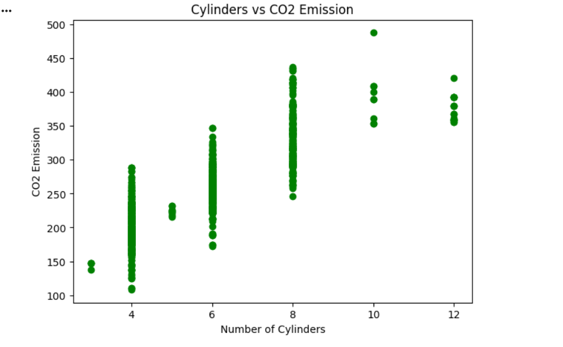

# Experiment - 1

## AIM
Create a scatter plot between cylinder vs Co2Emission (green color)

## Algorithim
Import required libraries and load the dataset using read_csv(), then display initial records.

Select relevant columns (CYLINDERS, ENGINESIZE, FUELCONSUMPTION_COMB, CO2EMISSIONS) for analysis.

Preview the selected data to confirm columns.

Create a scatter plot by taking CYLINDERS as the x-axis and CO2EMISSIONS as the y-axis.

Display the scatter plot with appropriate labels and title to visualize the relationship.

## PROGRAM
```
# ==========================
# Importing necessary libraries
import pandas as pd
import matplotlib.pyplot as plt
from sklearn.model_selection import train_test_split
from sklearn.linear_model import LinearRegression
from sklearn.metrics import r2_score
# --------------------------
# Step 1: Load dataset
# --------------------------
# Replace 'FuelConsumption.csv' with your dataset file name
df = pd.read_csv('FuelConsumption.csv')
# Display first few rows
print("Dataset Preview:")
print(df.head())
# --------------------------
# Step 2: Select useful columns
# --------------------------
data = df[['CYLINDERS', 'ENGINESIZE', 'FUELCONSUMPTION_COMB', 'CO2EMISSIONS']]
print("\nSelected Columns:")
print(data.head())
# --------------------------
# Q1: Scatter plot (CYLINDERS vs CO2EMISSIONS)
# --------------------------
plt.figure(figsize=(7,5))
plt.scatter(data['CYLINDERS'], data['CO2EMISSIONS'], color='green')
plt.title('Cylinders vs CO2 Emission')
plt.xlabel('Number of Cylinders')
plt.ylabel('CO2 Emission')
plt.show()
```
## Output
 Dataset Preview:
   MODELYEAR   MAKE       MODEL VEHICLECLASS  ENGINESIZE  CYLINDERS  \
0       2014  ACURA         ILX      COMPACT         2.0          4   
1       2014  ACURA         ILX      COMPACT         2.4          4   
2       2014  ACURA  ILX HYBRID      COMPACT         1.5          4   
3       2014  ACURA     MDX 4WD  SUV - SMALL         3.5          6   
4       2014  ACURA     RDX AWD  SUV - SMALL         3.5          6   

  TRANSMISSION FUELTYPE  FUELCONSUMPTION_CITY  FUELCONSUMPTION_HWY  \
0          AS5        Z                   9.9                  6.7   
1           M6        Z                  11.2                  7.7   
2          AV7        Z                   6.0                  5.8   
3          AS6        Z                  12.7                  9.1   
4          AS6        Z                  12.1                  8.7   

   FUELCONSUMPTION_COMB  FUELCONSUMPTION_COMB_MPG  CO2EMISSIONS  
0                   8.5                        33           196  
1                   9.6                        29           221  
2                   5.9                        48           136  
3                  11.1                        25           255  
4                  10.6                        27           244  

Selected Columns:
   CYLINDERS  ENGINESIZE  FUELCONSUMPTION_COMB  CO2EMISSIONS
0          4         2.0                   8.5           196
1          4         2.4                   9.6           221
2          4         1.5                   5.9           136
3          6         3.5                  11.1           255
4          6         3.5                  10.6           244



## Result
Thus the python program was able to create a scatter plot between cylinder vs Co2Emission (green color)

# Experiment - 2

## AIM
Using scatter plot compare data cylinder vs Co2Emission and Enginesize Vs Co2Emission using different colors

## Algorithim
1. Create a new figure for plotting using `plt.figure()`.

2. Plot a scatter graph of `CYLINDERS` vs `CO2EMISSIONS` with a label.

3. Plot another scatter graph of `ENGINESIZE` vs `CO2EMISSIONS` on the same figure with a label.

4. Add title, axis labels, and legend for comparison clarity.

5. Display the combined scatter plot using `plt.show()`.

## Program
```
plt.figure(figsize=(7,5))
plt.scatter(data['CYLINDERS'], data['CO2EMISSIONS'], color='blue', label='Cylinders')
plt.scatter(data['ENGINESIZE'], data['CO2EMISSIONS'], color='red', label='Engine Size')
plt.title('Comparison: Cylinders vs Engine Size (CO2 Emission)')
plt.xlabel('Value')
plt.ylabel('CO2 Emission')
plt.legend()
plt.show()
```

## Output


## Result
Thus, the program was successfully able to use scatter plot to compare data  cylinder vs Co2Emission and Enginesize Vs Co2Emission using different colors

# Experiment - 3

## Aim
Using scatter plot compare data   cylinder vs Co2Emission and Enginesize Vs Co2Emission and FuelConsumption_comb Co2Emission using different colors

## Algorithim
1. Initialize a plot figure of defined size using `plt.figure()`.
2. Plot scatter graphs for three feature relationships with `CO2EMISSIONS` (`CYLINDERS`, `ENGINESIZE`, `FUELCONSUMPTION_COMB`) using different colors.
3. Label each scatter plot using `label` to distinguish features.
4. Add plot title, axis labels, and legend for clarity.
5. Display the plot with `plt.show()` to compare all three features visually.

## Program
```
plt.figure(figsize=(7,5))
plt.scatter(data['CYLINDERS'], data['CO2EMISSIONS'], color='green', label='Cylinders')
plt.scatter(data['ENGINESIZE'], data['CO2EMISSIONS'], color='blue', label='Engine Size')
plt.scatter(data['FUELCONSUMPTION_COMB'], data['CO2EMISSIONS'], color='red', label='FuelConsumption_comb')
plt.title('Comparison of Multiple Features vs CO2 Emission')
plt.xlabel('Value')
plt.ylabel('CO2 Emission')
plt.legend()
plt.show()
```

## Output


## Result
Thus the program was successfully able to Use scatter plot  to compare data   cylinder vs Co2Emission and Enginesize Vs Co2Emission and FuelConsumption_comb Co2Emission using different colors

# Experiment - 4

## Aim
Train your model with independent variable as cylinder and dependent variable as Co2Emission

## Algorithim
1. Separate the dataset into input feature `CYLINDERS` (X1) and target variable `CO2EMISSIONS` (y).
2. Split the data into training and testing sets using `train_test_split()`.
3. Create a linear regression model and train it using the training data.
4. Predict CO2 emission values for the test set using the trained model.
5. Evaluate model performance using R2 score and print the accuracy.

## Program
```
X1 = data[['CYLINDERS']]
y = data['CO2EMISSIONS']
X1_train, X1_test, y_train, y_test = train_test_split(X1, y, test_size=0.2, random_state=42)
model1 = LinearRegression()
model1.fit(X1_train, y_train)
y_pred1 = model1.predict(X1_test)
acc1 = r2_score(y_test, y_pred1)
print("\nModel 1 (Cylinders vs CO2Emission) Accuracy (R2 Score):", round(acc1, 3))
```
## Output


## Result
Thus, we were successfully able to train the model with independent variable as cylinder and dependent variable as Co2Emission

# Experiment - 5

## Aim
Train another model with independent variable as FuelConsumption_comb and dependent variable as Co2Emission

## Algorithim
1. Select `FUELCONSUMPTION_COMB` as the input feature (X2) and keep `CO2EMISSIONS` as the target (y).
2. Split the data into training and testing sets with `train_test_split()`.
3. Train a linear regression model using the training data.
4. Predict target values for the test data using the trained model.
5. Calculate the R2 score to evaluate model accuracy and print the result.

# Program
```
X2 = data[['FUELCONSUMPTION_COMB']]
X2_train, X2_test, y_train, y_test = train_test_split(X2, y, test_size=0.2, random_state=42)
model2 = LinearRegression()
model2.fit(X2_train, y_train)
y_pred2 = model2.predict(X2_test)
acc2 = r2_score(y_test, y_pred2)
print("Model 2 (FuelConsumption_comb vs CO2Emission) Accuracy (R2 Score):", round(acc2, 3))
```

## Output


## Result
Thus we were successfully able to train another model with independent variable as FuelConsumption_comb and dependent variable as Co2Emission

# Experiment - 6

## Aim
Train your model on different train test ratio and train the models and note down their accuracies

## Algorithim
1. Define different test size ratios to compare model performance.
2. For each ratio, split data into training and testing sets using `train_test_split()`.
3. Train a linear regression model on each training set.
4. Predict values on the respective test sets and compute R2 accuracy.
5. Store and print the accuracy scores for each test ratio to observe performance changes.

## Program
```
ratios = [0.1, 0.2, 0.3, 0.4]
accuracy_scores = []
for ratio in ratios:
  X_train, X_test, y_train, y_test = train_test_split(X2, y, test_size=ratio, random_state=42)
  model = LinearRegression()
  model.fit(X_train, y_train)
  y_pred = model.predict(X_test)
  acc = r2_score(y_test, y_pred)
  accuracy_scores.append((ratio, round(acc, 3)))
print("\nDifferent Train-Test Split Accuracies (FuelConsumption_comb vs CO2Emission):")
for r, a in accuracy_scores:
  print(f"Test Size: {r}, R2 Score: {a}")
```

## Output


## Result
Thus we were successfully able to train the model on different train test ratio and train the models and note down their accuracies


